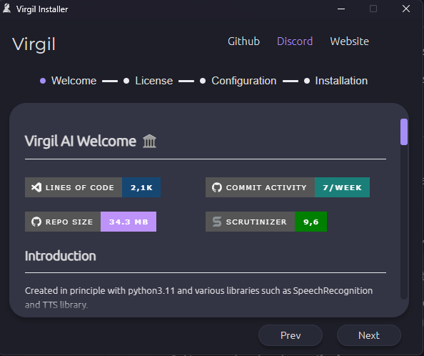
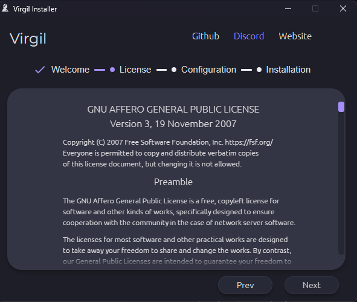
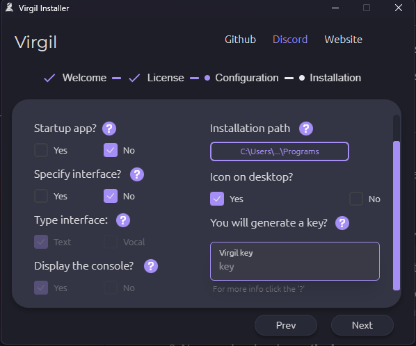
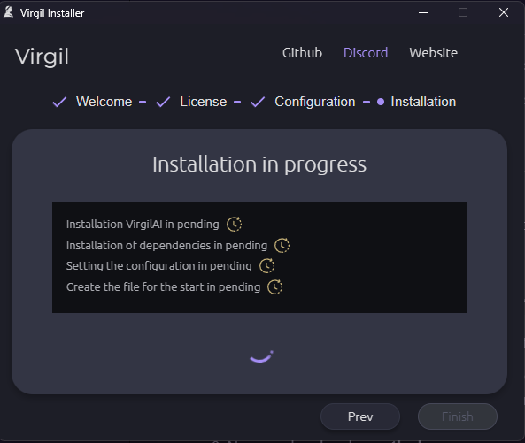

# Virgil-Installer 🥙 | Last docs update: 03/01/2024 (d/m/y)

An Electron application with React created for allow a simple installation of [VirgilAI](https://github.com/ProjecVirgil/VirgilAI)

## Showcase

          |  
:-------------------------:|:-------------------------:
  |  

## Use and Installation

1. The first step is to **download the executable file** of the latest version.
2. **This file will take care of preparing the actual installer (strange that it is an installer for an installer).
3. Now the actual installer will **start itself**.
4. If you don't want to read the introductory file, type **[this page](https://github.com/ProjecVirgil/VirgilAI)**, go ahead.
5. **Accept the "license"**.
6. OK, now the important part: all options have their own explanation, just click **these buttons:**  once the options have been chosen, go ahead.
7. If the installation takes more than 10/15 minutes, contact support (via github or otherwise).
8. Now go ahead and **save the key**.
9. You can **now run VirgilAI** by simply searching for it in the search bar.

## Modify the installation

> Simple re-run the installer and you can modify the config of installation

## Environment installation | In details

### So the installer install python version 3.11.7

- If you have the same version of python should not overwrite the current

- If you have a different version of python it will not overwrite the current one in the path, and when the installer uses python, it will use the installation path directly.

### Python library

VirgilAI use the venv environment so the libraries **will not overwrote**

## Manual installation modification

For modify the installation manually go on the path of installation generally `C:\Users\username\AppData\Local\Programs\Virgil-Installer` and search `config.json`

The basic config can appear like this, simple modify and save the file

```json
{
  "first_start": true,
  "startup": false,
  "specify_interface": false,
  "type_interface": "N",
  "installation_path": "C:\\Users\\deadr\\AppData\\Local\\Programs",
  "icon_on_desktop": true,
  "display_console": true,
  "key": ""
}
```

## Other

As mentioned above, VirgililAI is part of a larger project that includes an app, a website and others, the links of which are at Project:

### [Website](https://projectvirgil.net)

### [Mobile APP](https://github.com/Retr0100/VirgilApp)

### [Analysis of ML](https://github.com/Retr0100/VirgilML)

## Credits

The project is made by one person and is still in development, I'm looking for someone to give me advice and a hand to continue the project, which I believe is an excellent open source and free alternative to devices like Alexa or Google Home.

### Contact me

For code related issues you can use github directly for other collaborations or alerts write to this email <projectvirgilai@gmail.com>

If you want to support a small developer take a [**special link**](https://www.paypal.me/Retr0jk)

<a href="https://www.paypal.com/paypalme/Retr0jk">
  
</a>
</div>

### Licence

- AGPL-3.0 licence
- [LICENSE FILE](https://github.com/Retr0100/VirgilAI/blob/master/LICENSE)
